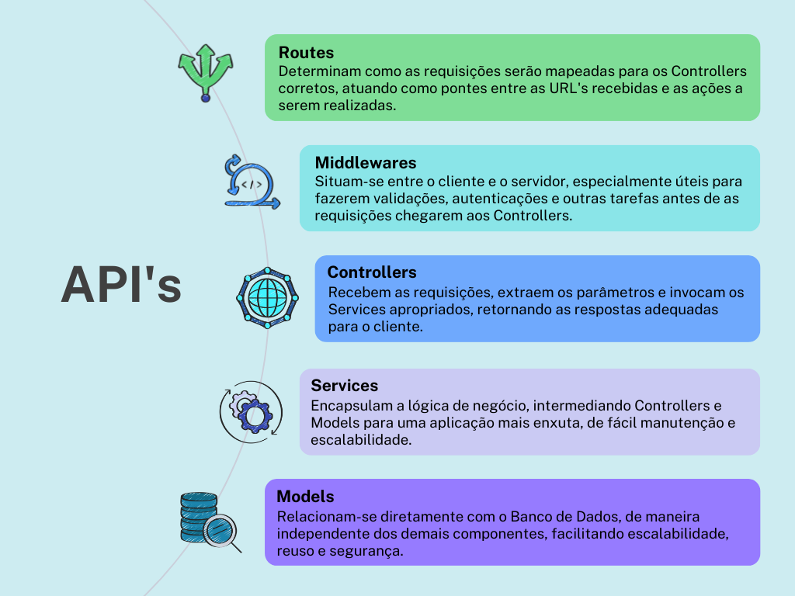

O projeto foi criado para colocar em prática a criação de uma API, permitindo a criação, leitura, atualização e destruição (CRUD) dos dados. Para tanto foi utilizado um banco de dados relacional `MySQL`. Outro grande objetivo do projeto é a criação de testes unitários e de integração, com 100% de cobertura de testes, utilizando os frameworks `Mocha`, `Chai`, `Sinon` e `Chai-http`. Para gerar mutações no código e verificar a cobertura de testes, foi utilizado o framework `Stryker`.

## 🧑‍💻 Habilidades Desenvolvidas

  * Criar uma API usando `Express`;

  * Aplicar conceitos de arquitetura baseada em camadas;

  * Criar endpoints para realizar operações _CRUD_;

  * Criar um banco de dados relacional usando o `MySQL`;

  * Estabelecer conexão entre o banco de dados e a API;

  * Escrever testes de integração;

  * Escrever testes unitários;

  * Alcançar 100% de cobertura de testes em ambas as abordagens;

  * Os testes eliminam todas as mutações do código geradas pelo `Stryker`;

___
### 📐 Arquitetura baseada em camadas

No desenvolvimento da aplicação, a organização do código seguiu uma abordagem de arquitetura baseada em camadas, com o objetivo de separar as responsabilidades e facilitar a manutenção do código.
Para tanto, foram criadas as seguintes camadas:

---
## 🧑‍🔬 Testes

A aplicação possui 100% de cobertura de testes, tanto *testes unitários* quanto *testes de integração*. Para tanto, foram utilizados os frameworks `Mocha`, `Chai`, `Sinon` e `Chai-http`. Para gerar mutações no código e verificar a cobertura de testes, foi utilizado o framework `Stryker`.
Para executar os testes, no diretório da aplicação `backend` você poderá executar os seguintes comandos:

`npm run test:mocha` para executar todos os testes com o `Mocha`;
`npm run test:mutation` para executar os testes com o `Stryker`, gerando mutações e recebendo o relatório de execução;
`npm run test:coverage` para checar a cobertura de testes.

___
## 💻 Tecnologias usadas

  * NodeJS

  * Express

  * Nodemon

  * JavaScript

  * MYSQL

  * Docker

  * Mocha

  * Chai

  * Sinon

  * Chai-http

  * Stryker

___

## 🐋 Rodando o projeto com Docker
Para rodar o projeto utilizando docker, no diretório da aplicação execute o comando:

`docker-compose up -d`

Para acompanhar os logs do container do servidor backend, com nodemon já em execução:

`docker logs -n 10 -f store_manager`

___

## 📝 Documentação da API

A documentação desta API está disponível nest link: [Documentação da API](https://documenter.getpostman.com/view/29177531/2s9Y5R3SWC)

___

### ⭐️

Se este repositório te ajudou de alguma forma, deixe uma ⭐️!